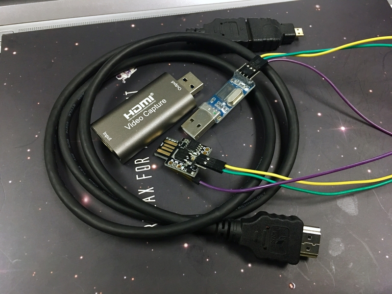

# Sharing Your Laptop Screen and Keyboard (Mouse?) with Raspberry Pi

*Using arduino-serial-to-keyboard*

**NOTE**: This article was translated by ChatGPT from the Traditional Chinese version, so it might look a bit scary. If you can read Chinese, you can refer to [中文版 README(README.zh_tw.md)](README.zh_tw.md)

## About the article

This article explores how to directly share your laptop's screen and keyboard with the Raspberry Pi.

While VNC, Synergy (or Barrier) can accomplish these tasks, they require a functioning Linux system and proper network configuration in advance. If, one day, there's a network issue, you may still need to connect a keyboard and monitor for troubleshooting. Is it possible to directly share your laptop's screen and keyboard with the Raspberry Pi, even in situations like this? Or when setting up a Raspberry Pi for the first time, is it feasible to skip preparing a set of mouse, keyboard, and screen and instead use your laptop's peripherals for the installation?

I personally categorize this sharing method as an "emergency use" case. So while I've discovered some decent solutions during my research, if the cost is too high, it may not be the best option for emergency situations.

PS: If you're in a hurry and want to skip the research part, you can jump directly to the [DIY Ideas](#diy-idea) section.


## Introduction - about "Headless"

I recently came across `Headless installation` due to my learning needs. The term "Headless" refers to a setup without a user interface, meaning installing a system without a monitor, keyboard, or mouse.

This article doesn't focus on explaining the methods of Headless installation. If you've ever used a Pi Zero or even Home Assistant, you're probably familiar with this type of installation. Typically, the need for a Headless installation arises when you don't have extra screens, keyboards, mice, or simply because of convenience (or laziness, in some cases 😄).

Devices installed in "Headless mode" often continue to operate in that mode after installation and configuration. For instance, when using a Pi as a server, during the initial setup, you might require a screen, mouse, and keyboard. However, once the configuration is complete, you can remove these peripherals and manage the device remotely over the network.

Therefore, screens, mice, and keyboards are usually temporary necessities for devices suited for Headless operation and are not something most people are willing to invest heavily in preparing.


## Initial Idea

Even with a Headless installation, in reality, a complete set of screen, mouse, and keyboard is still needed at the "installation site" – yes, it's the laptop or computer that you use for configuration. So, the question worth pondering is, is it possible to directly share your laptop's screen, mouse, and keyboard with the Raspberry Pi?

A few weeks ago, I came across information about `HDMI Input` in the community, and the following video demonstrates it very clearly. (Click the image below to watch the video.)

[](https://youtu.be/GkbmeYgTVlc)

The overall architecture is like this:


Once you insert a USB HDMI video capture card into your laptop, your computer gains an additional Video Input device. Then, with any software that can select a video input source, you can see the HDMI Input video signal. For example, software like [OBS Studio](https://obsproject.com/) can display the video (and even record it). Additionally, if you're a Windows 10 user, you can use the [Windows Camera App](https://www.microsoft.com/zh-tw/p/windows-camera/9wzdncrfjbbg?activetab=pivot:overviewtab) to access the HDMI Input video.

PS: VLC media player can also be used, but in my testing, the resolution was quite poor, and it requires some adjustments


### Mobile/Tablet Applications

Regarding the use of a USB HDMI video capture card, you can also use a mobile phone or tablet as an emergency screen for the Raspberry Pi through an OTG cable. (Click the image below to watch the video.)

[](https://www.youtube.com/watch?v=nui8kXvUAys)

Currently, Android phones/tablets are more convenient for this purpose, and the necessary OTG cables are relatively cheap. If you're using iOS, you'll need a lightning cable that supports UVC (USB Video Class). I've only found such a product on [febon.net](https://www.febon.net/products/usb-uvc-webcam-to-lightning?locale=zh-hant), but it's quite expensive, costing around $139 USD.


### Linux console

Generally, you can redirect the Pi's console to the UART interface. In this case, you may not need to use the serial-to-HID-keyboard approach mentioned in this article. You just need to identify the UART pins on your Pi and connect them to a USB-to-serial adapter. According to the Raspberry Pi official documentation on [UART configuration](https://www.raspberrypi.org/documentation/configuration/uart.md), the Primary UART is assigned by default to be used as the Linux console. Some versions of Pi that support Bluetooth might have the UART already occupied, which would require additional configuration.

However, if you use USB emulation for an HID keyboard as described in this article, you don't need to worry about these configurations. Regardless of the Pi model, when you connect the USB development board created in this article, the Pi will recognize it as a keyboard.


### Conclusion

when we talk about the user interface in computer terms, we refer to KVM, which stands for Keyboard, Video, and Mouse. Now that we can share a laptop's screen using a USB HDMI video capture dongle, you might be curious if it's possible to achieve the remaining KM (Keyboard and Mouse) sharing.


## Existing solutions

Regarding the sharing of KVM, there are already some solutions available in the market. Some products can perfectly solve the sharing of KVM, some only provide KM sharing, but not every solution allows you to use the host's built-in screen, mouse, and keyboard directly. Some solutions may even require the setup of a local area network environment in advance.

### 1. KVM switch

When it comes to sharing screens, keyboards, and mice, we have to talk about "KVM switches." The diagram for a KVM switch is as follows: you connect a keyboard, monitor, and mouse to a switch, and then you use the switch's buttons to decide which computer gets to use this set of KVM. In the diagram, those three computers don't need an additional KVM.


However, even if you replace those three computers in the diagram with laptops, you still need a set of KVM as the source. The built-in KVM on laptops cannot be used as a source to share with other computers.


### 2. Synergy (or Barrier)

[Synergy](https://zh.wikipedia.org/wiki/Synergy) is a good solution. As long as your host (laptop) and target (Raspberry Pi) are on the same local network, you can share your laptop's mouse and keyboard (but not the screen; you need to install a screen on the target).

However, Synergy still requires configuration and launching of related applications on the target. It cannot be used without prior setup. Additionally, Synergy needs the Linux system to boot up before it can work. If there are network issues, you still have to connect a monitor and mouse to see what's happening with the system.


### 3. Smart KM Link

There's another product on the market called "Smart KM Link," which claims to allow sharing of a mouse and keyboard between two computers, and even file copying. However, it seems that the product currently support only Windows and Mac systems. I'm not sure if they would work for sharing KM with a Linux host (or a Raspberry Pi) on the other end. If you happen to know, please share the information! (Click the image below to watch the video)

[](https://www.youtube.com/watch?v=eNn8RMQIJqE)


### 4. ATEN Portable KVM Controller CV211

[ATEN Portable KVM Controller CV211](https://www.aten.com/tw/zh/products/kvm%E5%A4%9A%E9%9B%BB%E8%85%A6%E5%88%87%E6%8F%9B%E5%99%A8/%E5%B8%B6%E7%B7%9A%E5%BC%8Fkvm%E5%A4%9A%E9%9B%BB%E8%85%A6%E5%88%87%E6%8F%9B%E5%99%A8/cv211/) is currently the only complete solution I've found that allows for direct sharing of a laptop's screen, mouse, and keyboard. You can even record the controlled device's screen using the host-side software developed by the manufacturer. (Click the image below to watch the video)

[](https://www.youtube.com/watch?v=eb2j-qtWTP0)

However, the drawback is that it's quite expensive! The price on [PChome.com](https://24h.pchome.com.tw/prod/DCAX4H-A9008WPCS) is $9700 TWD! It might not be a worthwhile investment for someone who doesn't have this kind of need frequently.


## DIY Idea

While researching cost-effective solutions, I thought of certain versions of Arduino development boards that can emulate an HID Keyboard. For example, the once-popular [Makey Makey](https://makeymakey.com/). If you look at its [schematic](http://cdn.sparkfun.com/datasheets/Dev/Arduino/Boards/makey_makey-v12.pdf), you'll find that it can interact with computer games because its main microcontroller, the Atmega32u4, can emulate an HID Keyboard.

In the Arduino development board series, readily available Atmega32u4 development boards include the [Leonardo](https://store.arduino.cc/usa/leonardo) and [Pro Micro](https://www.sparkfun.com/products/12640). In terms of size, the Pro Micro is more compact and convenient.


### Implementation Idea

So, my idea is to use the Pro Micro in conjunction with Arduino's official Keyboard library to simulate a USB HID Keyboard. When the Pro Micro is plugged into the Raspberry Pi, the Pi should recognize it as a USB keyboard. Next, I'll connect the Pro Micro's UART to my controlling laptop using a USB-to-Serial module.

Then, in the control program of the Pro Micro, I just need to write a simple logic:

> Whenever a character is received from UART, it will be output to the HID interface using the API provided by the Keyboard library.

The expected scenario is that when I open the serial port and type any character to the COM port, it should be forwarded to the Raspberry Pi! The architecture diagram looks like this:


To summarize, the cheap solution for sharing KVM with a Pi through a laptop is:

* K (Keyboard): Simulate an HID Keyboard using Atmega32u4.
* V (Screen): Use a USB HDMI video capture card.
* M (Mouse): Simulate an HID Mouse using Atmega32u4.

PS: Regarding the mouse, in fact, Atmega32u4 can also simulate an HID Mouse, but it's a bit more complicated to implement. I'll explain more about it later.


## Standing on the shoulders of giants

Before cooking on any project, it's a good idea to see if someone else has already done something similar. Here are two projects I found:


### 1. Nehebkau by Frank Zhao

At the beginning, I found this Raspberry Pi forum post: [Using Laptop as keyboard and mouse](https://www.raspberrypi.org/forums/viewtopic.php?t=4762).

Below is a video demonstrating the results created by the author (click on the image to watch the video):

[](https://www.youtube.com/watch?v=iXMBKlIrzQs)

The detailed explanation can be found on the [author's blog]((https://eleccelerator.com/nehebkau-laptop-controlled-keyboard-and-mouse/)). It uses two ATmega32U4 devices for the connection:


So, you can imagine that the target end (Raspberry Pi) doesn't need to do much; it simply acts like it's connected to an HID keyboard. However, on the host end (the laptop), it's essentially connected to "another" HID device. Therefore, it requires writing an application to capture the laptop's native keyboard input, then forward it to the connected HID device, and finally transmit it to the target end through the device created by the author.

This technology is quite advanced for me, as it involves writing Windows applications (in C#). Very impressive!


#### How Nehebkau Handles the Mouse

Firstly, mouse behavior can also be simulated using Atmega32u4. You need to write an application on the host side to capture your mouse behavior (coordinate information) and then send it through the HID interface. If you're using the Windows platform, technically, you would need to know which Windows APIs can help you capture mouse behavior. However, I think the trickier part is that the screen resolutions on the host side and target side are different.

So, in my survey, I noticed that most methods required setting the target screen's resolution in the application and then making scaling adjustments. You can map your entire screen, generate a small pad on the application screen, and synchronize the target-side mouse coordinates when the mouse enters this pad area. Alternatively, you could implement the concept of an extended desktop.


#### About the master - Frank Zhao

I really admire this project, it requires a deep understanding of USB technology to accomplish. Frank Zhao is a hardware engineer at Sony and has previously worked at [Adafruit](https://blog.adafruit.com/author/frank/), where he authored several USB-related articles. If you're interested in the maker community, I bet you've seen his USB Business Card project before: (Click here to watch the video).

[](https://www.youtube.com/watch?v=vX1tDk_iwOo)


### 2. KeyMouSerial by Peter Burkimsher

[KeyMouSerial](http://peterburk.github.io/programs/) is the second project I fiund. It's closer to my initial idea, simply transmitting keyboard key presses and mouse movements using Atmega32u4 to the other end. Like Nehebkau mentioned earlier, if you want to handle mouse events, you'll need to write an application on the host side. The author of this project have developed corresponding applications for Windows, Mac, and Linux.

All the code is available on the [author's GitHub: keyMouSerial](https://github.com/peterburk/keyMouSerial). If you open the Arduino program [keyMouSerial.ino](https://github.com/peterburk/keyMouSerial/blob/master/Arduino/keyMouSerial.ino), it's not as complicated as it might seem. If you don't want to deal with mouse events (like me), the most important lines of code are actually just these two:

```c
char inChar = (char)Serial1.read();
Keyboard.write(inChar);
```

Additionally, the author is working to make keyMouSerial support with [Rockbox](https://www.rockbox.org/), which might be interesting for some users to explore.


#### About the master - Peter Burkimsher

Peter Burkimsher is from New Zealand, and as a Taiwanese, I was quite surprised to find out that he worked in Kaohsiung, Taiwan, between 2014 and 2018!


## My Implementation


I first worked on the Pro Micro, but later I found that the [Digispark](http://digistump.com/products/1), which uses the Attiny85 microcontroller, can also simulate an HID keyboard. So, I provided code for both in my [GitHub repo](https://github.com/andrewintw/arduino-serial-to-keyboard). Here's a breakdown of the directory structure:

* [ProMicro](https://github.com/andrewintw/arduino-serial-to-keyboard/tree/main/ProMicro): This directory contains the Pro Micro version
	* [ProMicro_SerialToKeyboard](https://github.com/andrewintw/arduino-serial-to-keyboard/blob/main/ProMicro/ProMicro_SerialToKeyboard/ProMicro_SerialToKeyboard.ino) is the final working version, while other programs starting with "Test_ProMicro_" are test programs.
* [DigiSpark](https://github.com/andrewintw/arduino-serial-to-keyboard/tree/main/DigiSpark): This directory contains the DigiSpark version
	* [DigiSpark_SoftSerial_to_Keyboard](https://github.com/andrewintw/arduino-serial-to-keyboard/blob/main/DigiSpark/DigiSpark_SoftSerial_to_Keyboard/DigiSpark_SoftSerial_to_Keyboard.ino) is the final working version, while other programs starting with "Test_DigiSpark_" are test programs.


I conducted my tests in a Windows 7 environment. Since I'm not proficient in Windows programming, I don't plan to work on the mouse forwarding part. I don't frequently use a mouse when working with Linux, and you can find serial software for Windows/Mac/Linux. While I did consider writing a Python version, it would require more learning time, so I've set that plan aside for now.

PS: In Taiwan, a Pro Micro costs around $150 TWD, and a DigiSpark costs around $60 TWD.


## ProMicro_SerialToKeyboard

The Pro Micro compatible boards available on the market typically look like this:


The original manufacturer of the Pro Micro is Sparkfun, but it seems that Sparkfun's BSP (Board Support Package) for the Pro Micro is not included in the Arduino IDE. Possibly for this reason, most compatible boards on the market come preloaded with the Leonardo bootloader. This allows you to use the Leonardo board setting in the Arduino IDE. However, if you want to use Sparkfun's official BSP, you'll need to follow the instructions in the [Pro Micro & Fio V3 Hookup Guide](https://learn.sparkfun.com/tutorials/pro-micro--fio-v3-hookup-guide/all) to add Pro Micro support to the Arduino IDE. Then, you can use an Arduino UNO to burn the "official" Pro Micro bootloader to your compatible board. After that, you can select Pro Micro directly in the IDE.

Of course, you could also choose to take an easier route and simply use the Leonardo configuration.


## DigiSpark_SoftSerial_to_Keyboard


I also created a version for DigiSpark. I prefer DigiSpark because it comes with a built-in USB connector and is smaller in size compared to the Pro Micro. Therefore, the following demonstrations will primarily focus on DigiSpark.

When using DigiSpark, you should refer to the official documentation [Connecting and Programming Your Digispark](http://digistump.com/wiki/digispark/tutorials/connecting) to understand how to configure the Arduino IDE and flash the firmware.

One thing to pay attention to is the uploading process. When you connect the DigiSpark to the computer, the Arduino IDE won't show a COM port. The uploading method is to first disconnect the DigiSpark, then click Upload in the Arduino IDE. Wait until a message appears in the status bar saying `"Plug in device now... (will timeout in 60 seconds)"`. After that, within 60 seconds, plug the DigiSpark back into the computer. This will complete the firmware upload.


### DigiSpark Library

Pro Micro doesn't require any additional libraries, but DigiSpark does.

In the DigiSpark/ [libraries/](https://github.com/andrewintw/arduino-serial-to-keyboard/tree/main/DigiSpark/libraries) directory, there's an included [Digispark_SoftSerial-INT0](https://github.com/andrewintw/digispark_softserial-int0) library.

The original author's repository is [J-Rios/Digispark_SoftSerial-INT0](https://github.com/J-Rios/Digispark_SoftSerial-INT0). After forking it into my repository, I made some configurations following the Arduino Library guidelines to ensure you can see the examples written by J-Rios in the IDE menu.


#### How to Download the Code


If you want to use DigiSpark, when cloning, please use the following command to also clone the submodule:

```
git clone git@github.com:andrewintw/arduino-serial-to-keyboard.git --recurse-submodules
```

Alternatively, you can split it into two commands (usually for those who forget to add `--recurse-submodules`):

```
git clone git@github.com:andrewintw/arduino-serial-to-keyboard.git
git submodule update --init --recursive
```

Of course, you can also manually clone it by navigating to DigiSpark/libraries/ and then running:

```
cd DigiSpark/libraries/
git clone git@github.com:andrewintw/Digispark_SoftSerial-INT0.git
```


## HOW To Test


### 1. Connect UART

Don't forget that our setup looks like this. So, you'll need a USB-to-Serial USB module (e.g., FTDI FT232R, CP2102, PL2303, CH340... in order of increasing price). Then, connect the TX, RX, and GND pins to the UART pins on the Pro Micro/DigiSpark.


You'll need to refer to the pinout diagram for Pro Micro and DigiSpark:

For Pro Micro, it's pin 1 (TX) and pin 0 (RX).


For DigiSpark using SoftSerial, it's defined as P1 (TX) and P2 (RX) in the code.

 


### 2. Check Your New HID Device

If your program is correct, when you plug the Pro Micro/DigiSpark into the host laptop, your device manager should show a new "HID Keyboard Device."


### 3. Test with a VM

You can directly test with a Raspberry Pi. But if you want a quick test, you can use a virtual machine (VM). VM software detects USB devices on the host, and you can choose to attach the HID device emulated by Pro Micro/DigiSpark to the VM environment. For example, in the image below, "digistump.com DigiKey" is the HID Keyboard Device emulated by DigiSpark.


When you successfully attach the emulated HID device from DigiSpark to the VM environment, the corresponding entry on the host's device manager will disappear (which is expected). The VM environment will recognize it as an attached HID keyboard.


## 4. Open the Serial Port for Testing

Use serial software (e.g., PuTTY) to open the COM port corresponding to the USB-to-Serial module at 9600-8-n-1. Start typing, and you should see the characters you input in the serial software appearing in real-time on the target screen. There will be wiring instructions later.


## Making the Cable & Real Testing

For the DigiSpark development board, you only need to connect P1, P2, and GND.


Find a cheap USB-to-Serial module in your drawer.


When soldering, try to keep it as low and thin as possible to avoid blocking other USB ports when the DigiSpark is plugged into the Pi's USB port.


DONE！！！！


If you want to test with a VM first, here's how it's connected.


Then, attach the emulated HID device from DigiSpark to the VM environment.


VM Demo Video: (Click the image to watch)

[](https://www.youtube.com/watch?v=uBaW8750mxo)


The final setup looks like this. You're now sharing the host laptop's keyboard and monitor.


### Demo Video (Click the image to watch)

[](https://www.youtube.com/watch?v=RSEqx5DlrbU) 

In this demo video, the running system is the Home Assistant. The system doesn't boot into a graphical interface but into a CLI menu. After logging in and entering the shell, you can use the tab key for auto-complete.

The Linux kernel for the Raspberry Pi usually includes USB keyboard drivers by default. In the video, you can see that after plugging in the DigiSpark, you need to wait a while for the drivers to load into the kernel (indicated by the DigiSpark's LED lighting up).

Alright! With this setup, you can carry around your USB HDMI capture card and this Serial-to-HID-keyboard cable (who wouldn't want that, right?). You can operate your Raspberry Pi anywhere without worrying about not having a keyboard and monitor (living the good life!).



## References

* [Debugging with the Digispark](https://digistump.com/wiki/digispark/tutorials/debugging)
* [Example programs for the DigiUSB library](https://github.com/digistump/DigisparkExamplePrograms)

~ END ~
