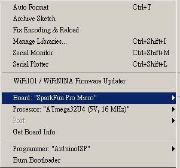

# arduino-serial-to-keyboard

## Pro Micro

* [Pro Micro & Fio V3 Hookup Guide](https://learn.sparkfun.com/tutorials/pro-micro--fio-v3-hookup-guide/all)

## Digispark

* [Connecting and Programming Your Digispark](http://digistump.com/wiki/digispark/tutorials/connecting)

* [Debugging with the Digispark](https://digistump.com/wiki/digispark/tutorials/debugging)

### Library

clone the repos `git@github.com:andrewintw/Digispark_SoftSerial-INT0.git` to libraries/ folder.

## How To Test

1. Chech your new HID Keyboard Device

2. Start a virtual machine on VirtualBox and attach the HID keyboard device to the virtual machine. 

note: Your host system will remove the HID keyboard.

3. Connect to UART with 9600-8-n-1 and start typing.
