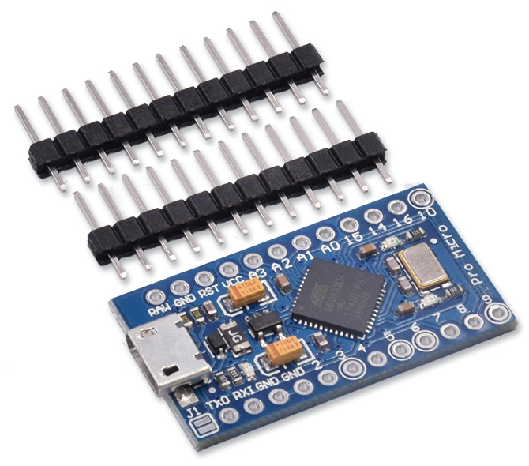

# 共享筆電的螢幕鍵盤(滑鼠?)給 Raspberry Pi

*使用 arduino-serial-to-keyboard*

## 前言 -- 關於 "Headless"

最近因為 pi 的學習需求接觸了 `Headless installation`，所謂的 "Headless" 就是沒有 User Interface，意指在沒有螢幕、鍵盤、滑鼠的狀況下安裝系統。

關於 Headless 的安裝方式不是這一篇要講的重點，如果你曾使用過 Pi Zero、甚至是 Home Assistant，應該對這樣的安裝方式感到熟悉。通常需要使用 Headless 模式安裝的情況都是因為沒有多餘的螢幕、鍵盤，或者...只是因為懶惰 XD。

而以 Headless 模式安裝的裝置，在安裝設定完成之後，通常就會繼續以 Headless 的狀態運作。例如使用 pi 當作伺服器時，在安裝配置的過程中你可能會需要螢幕、滑鼠、鍵盤的幫忙，但是一旦配置完畢，這些週邊就可以移除，改用網路遠端存取的方式去做設定。因此螢幕、滑鼠、鍵盤對於適合 Headless 的裝置來說只是暫時需要，通常不會願意花費太多成本在準備這些週邊上。

## 初始想法

但既使是 Headless 的安裝方式，事實上在 "安裝現場" 還是會有完整的一組螢幕滑鼠鍵盤...是的，就是你用來操作設定的筆電/電腦。那麼，值得思考的問題是，有沒有可能直接共用筆電上的螢幕、滑鼠、鍵盤給 Raspberry Pi 呢？

幾週前我在社群看到了關於 `HDMI Input` 的資訊，以下這個影片示範得非常清楚。（點擊下圖觀看影片）

它的整體架構是這樣的:

USB HDMI 影像擷取卡插入筆電後，電腦端就會多一個 Video Input 的裝置。接著只要使用 "任何可以選擇 Video 輸入來源" 的軟體都可以看到 HDMI Input 的 Video 訊號。例如配合 [OBS Studio](https://obsproject.com/) 的軟體就可以看到畫面了（甚至可以錄下畫面）。此外如果你是 Windows 10 的使用者，使用 [Windows Camera App](https://www.microsoft.com/zh-tw/p/windows-camera/9wzdncrfjbbg?activetab=pivot:overviewtab) 也可以從這個 HDMI Input 取得畫面。 

### 補充手機/平板的應用

關於 USB HDMI 影像擷取卡的應用，只要再透過一條 OTG 的傳輸線，就可以直接使用手機或平板當成 Raspberry Pi 的應急用螢幕。（點擊下圖觀看影片）

目前 Android phone/pad 對這件事情的支援比較方便，所需購買的 OTG 線材也算便宜。如果是 iOS，必須使用支援 UVC（USB Video Class）的 lightning 線材。目前我只找到 [febon.net](https://www.febon.net/products/usb-uvc-webcam-to-lightning?locale=zh-hant) 上有這樣的產品，但是...超級貴！需要台幣 $5669。

通常操作電腦時的使用者介面指的是 KVM，也就是鍵盤(Keyboard)、顯示器(Video)、滑鼠(Mous)的意思。既然現在 Video 已經可以透過一支 USB HDMI 影像擷取 dongle 做到分享筆電的螢幕，那麼你應該會想知道 -- 剩下的 KM（鍵盤和滑鼠）有沒有可能做到呢？

## 現有解決方案

關於共用 KVM 這件事情，市場上已經有一些解決方案，有些產品可以完美解決 KVM 的共用，有些只有 KM，但不是每一種方案都可以直接使用 host 端自帶的螢幕滑鼠鍵盤...甚至有些方案是需要預先建構區網環境的。

### 1. KVM switch

談到共用螢幕鍵盤滑鼠，就不得不提 "KVM 切換器" 這種產品。KVM 的示意圖如下，你需要在一台 switch 上接上鍵盤螢幕滑鼠，然後透過 switch 上的切換按鈕，決定將這一組 KVM 給哪一台電腦使用。示意圖中的那三台電腦都不需要額外的 KVM。

但就算示意圖的那三台電腦都換成筆電，你還是需要一組 KVM 當作 source，筆電本身的 KVM 是無法當作 source 共用給其它電腦的。

### 2. Synergy (or Barrier)

[Synergy](https://zh.wikipedia.org/wiki/Synergy) 是一個很不錯的解決方案，只要你的 host（筆電）和 target（樹莓派）在同一個區網內，就可以透過網路共享筆電的滑鼠鍵盤（沒有螢幕，你需要在 target 端安裝螢幕）。

但 Synergy 仍需要在受控端先進行設定，並且啟動相關的應用程式 -- 無法做到 "不設定就可以使用"。另外除了必須要在網路的環境中使用以外，Synergy 也必須等到 Linux 系統開機後才能啟動。假設網路出了問題，你還是得老老實實地接上螢幕滑鼠，看看系統發生了什麼事情。

### 3. Smart KM Link

市面上還有一種稱為 "Smart KM Link" 的傳輸線。標榜可以在兩台電腦之間共享滑鼠鍵盤，甚至複製檔案。（點擊下圖觀看影片）

看起來非常方便，但目前這類型的產品都只支援 Windows/Mac 系統，我不確定如果我另一端插入一台 Linux 主機（或是 pi），能不能做到共享 KM？如果你知道的話請告訴我！

### 4. ATEN 攜帶型KVM控制器 CV211

[ATEN 攜帶型KVM控制器 CV211](https://www.aten.com/tw/zh/products/kvm%E5%A4%9A%E9%9B%BB%E8%85%A6%E5%88%87%E6%8F%9B%E5%99%A8/%E5%B8%B6%E7%B7%9A%E5%BC%8Fkvm%E5%A4%9A%E9%9B%BB%E8%85%A6%E5%88%87%E6%8F%9B%E5%99%A8/cv211/) 是目前我看到唯一能做到直接共享筆電螢幕、滑鼠、鍵盤的完整解決方案！（點擊下圖觀看影片）透過廠商開發的 host 端軟體，你還可以直接錄製受控端的畫面。

但缺點就是 --- 超貴！XD [PChome 購物上](https://24h.pchome.com.tw/prod/DCAX4H-A9008WPCS)的售價是 $9700！對於一個不經常有這種需求的人來說不算是值得投資的東西。

## 自造想法

研究便宜的解決方案時，我突然想到某些版本的 Arduino 開發板可以將自己模擬成一台 HID Keyboard。例如曾經很熱門的 [Makey Makey](https://makeymakey.com/)，如果你去看它所公布的[電路圖](http://cdn.sparkfun.com/datasheets/Dev/Arduino/Boards/makey_makey-v12.pdf)，你會發現它之所以能跟電腦遊戲互動，是因為它的主要微處理器 -- Atmega32u4 可以模擬成 HID 鍵盤的關係。

在 Arduino 開發板系列中，容易取得的 Atmega32u4 開發板有 [Leonardo](https://store.arduino.cc/usa/leonardo) 和 [Pro Micro](https://www.sparkfun.com/products/12640)。以體積來說，當然是 Pro Micro 比較小巧方便。

### 實作想法

因此我的想法就是使用 Pro Micro 配合 Arduino 官方的 Keyboard library，將 Pro Micro 模擬成一台 USB HID Keyboard。當 Pro Mico 插入 Raspberry Pi 的時候，Pi 應該會認為有一台 USB 鍵盤接入。接著將 Pro Micro 的 UART 透過 USB-to-Serial 的模組接到我的控制筆電。

然後在 Pro Mico 的控制程式中，我只要簡單寫一段邏輯：

	只要從 UART 收到的字元，都透過 Keyboard library 提供的 API 輸出至 HID 介面 

預期的狀況是，當我打開 serial port 並對 COM port 輸入任何字元，應該就會轉送到 Raspberry Pi 了！架構圖如下：

小結一下，關於透過筆電共用 KVM 給 pi 的想法，便宜的解法就是：

* K（鍵盤）: 使用 Atmega32u4 模擬成 HID Keyboard
* V（螢幕）: 使用 USB HDMI 影像擷取卡 
* M（滑鼠）: 使用 Atmega32u4 模擬成 HID Mouse

ps: 關於滑鼠，事實上 Atmega32u4 也可以模擬成 HID 滑鼠，但是實作上有點麻煩，後面會說明。

## 神人的肩膀

做任何實作之前，最好先找找有沒有人已經做過類似的事情。以下是我找到的兩個作品。

### 1. Nehebkau by Frank Zhao

一開始我用關鍵字搜到了 Raspberry pi forums 的這篇：[Using Laptop as keyboard and mouse](https://www.raspberrypi.org/forums/viewtopic.php?t=4762)

下面這個影片是那位大大做出來的成果展示：（點擊下圖觀看影片）

說明在作者的[部落格](https://eleccelerator.com/nehebkau-laptop-controlled-keyboard-and-mouse/)中。它使用兩個 ATmega32U4 對接：

所以可以想像 Target 端（pi）不用處理，它就是接入了一個 HID 鍵盤。但是 Host 端（筆電）相當於接入了 "另一個" HID 裝置，所以它需要額外寫個應用程式擷取筆電原生的鍵盤訊號，然後轉發給那個接入的 HID 裝置，最後再透過作者所做的裝置傳給 Target 端。

這個技術對我來說太高級了，需要會寫 Windows 應用程式（C#），非常厲害！

#### Nehebkau 如何處理滑鼠

首先滑鼠的行為也是 Atmega32u4 可以模擬的，你需要在 host 端寫一個應用程式，擷取你的滑鼠行為（座標資訊），然後一樣透過 HID 介面送出去。如果你使用 Windows 平台，技術上你就必須要知道有哪些 Windows API 能協助你擷取滑鼠行為。但我認為更麻煩的是 -- host 端 和 target 端兩邊的螢幕解析度是不同的。

所以我在 survey 前人的神作時，看到的方式都是需要在應用程式中設定 target 螢幕的解析度，然後作比例上的 mapping 調整。你可以 mapping 你整個螢幕，或是在應用程式畫面上產生一個小 pad，滑鼠移入這個 pad 範圍時，同步控制 target 端的滑鼠座標。或是實作出延伸桌面的概念。

#### 關於神人 Frank Zhao

老實說我蠻欣賞這個案子的，但是它需要對 USB 技術非常熟悉才做得出來。Frank Zhao 是 Sony 的硬體工程師，之前曾在 [Adafruit](https://blog.adafruit.com/author/frank/) 工作過，寫過幾篇 USB 的專欄。如果你對自造議題感興趣的話，我敢打賭你肯定曾看過它的 USB Business Card 作品：（點擊下圖觀看影片）

### 2. KeyMouSerial by Peter Burkimsher

[KeyMouSerial](http://peterburk.github.io/programs/) 是我第二個搜尋到的專案。它比較接近我的原始想法，就只是個把鍵盤的按鍵和滑鼠的移動事件透過 Atmega32u4 轉送到另一端的方式。跟上面的 Nehebkau 一樣，如果要處理滑鼠的事件，你就需要在 host 端撰寫應用程式。這個作者一定非常有熱情，他同時替 Windows/Mac/Linux 寫了對應的應用程式。

所有的程式都公布在作者的 [GitHub: keyMouSerial](https://github.com/peterburk/keyMouSerial)。打開他寫的 Arduino 的程式 [keyMouSerial.ino](https://github.com/peterburk/keyMouSerial/blob/master/Arduino/keyMouSerial.ino)，跟我預期的一樣，其實沒有很複雜，如果你不想處理滑鼠的話（我不想 XD）其實最關鍵的程式碼只有這兩行：

	char inChar = (char)Serial1.read();
	Keyboard.write(inChar);

另外，作者正在努力讓 keyMouSerial 支援 [Rockbox](https://www.rockbox.org/) 有興趣的人可以加入研究。

#### 關於神人 Peter Burkimsher

Peter Burkimsher 來自紐西蘭，我蠻驚訝地發現，2014~2018 之間他曾在台灣的高雄工作過！

## 我的實作

一開始我先在 Pro Micro 實作，後來我發現使用 Attiny85 為主晶片的 [Digispark](http://digistump.com/products/1) 也可以做到 HID keyboard 的模擬，所以在我的 [GitHub repo](https://github.com/andrewintw/arduino-serial-to-keyboard) 中提供了這兩者的實作程式碼。目錄說明如下：

* [ProMicro](https://github.com/andrewintw/arduino-serial-to-keyboard/tree/main/ProMicro) 目錄放的就是 Pro Micro 的版本。
	* [ProMicro_SerialToKeyboard](https://github.com/andrewintw/arduino-serial-to-keyboard/blob/main/ProMicro/ProMicro_SerialToKeyboard/ProMicro_SerialToKeyboard.ino) 是最終的運作版本，其餘 "Test_ProMicro_" 開頭的程式都只是測試程式。
* [DigiSpark](https://github.com/andrewintw/arduino-serial-to-keyboard/tree/main/DigiSpark) 目錄放的就是 DigiSpark 的版本。
	* [DigiSpark_SoftSerial_to_Keyboard](https://github.com/andrewintw/arduino-serial-to-keyboard/blob/main/DigiSpark/DigiSpark_SoftSerial_to_Keyboard/DigiSpark_SoftSerial_to_Keyboard.ino) 是最終的運作版本，其餘 "Test_DigiSpark_" 開頭的程式都只是測試程式。

我的測試環境是 Windows 7。另外，因為我不會 Windows 程式設計，所以我目前不打算處理滑鼠轉送的部份了，畢竟操作 Linux 時，是不經常使用滑鼠的。況且不管是 Windows/Mac/Linux 都可以找到對應的 serial 軟體。我的確是有想過用 Python 寫一版，但這需要更長的學習時間，所以目前先擱置這個計劃。

ps: 在台灣 Pro Micro 約 $150 可以買到，DigiSpark 約 $60。

## ProMicro_SerialToKeyboard

在市面上能買到便宜的 Pro Micro 相容板通常長這樣：

Pro Micro 的原廠其實是 Sparkfun，但 Sparkfun 針對 Pro Micro 的 BSP 似乎沒有被包進 Arduino IDE。或許是這個原因，市面上的相容板通常都被廠商預燒錄了 Leonardo 的 Bootloader，所以在 Arduino IDE 上能使用 Leonardo 的 Board setting 燒錄。但如果你想要使用 Sparkfun 官方的 BSP，你需要先按照 [Pro Micro & Fio V3 Hookup Guide](https://learn.sparkfun.com/tutorials/pro-micro--fio-v3-hookup-guide/all) 的說明增加 Arduino IDE 對 Pro Micro 的支援。接著拿一台 Arduino UNO，替這個相容板燒錄 "正牌" Pro Micro 的 Bootloader。之後你就可以在 IDE 上直接選用 Pro Micro 了。

當然，或許你也可以不用這麼 "折騰自己"，直接使用 Leonardo 的設定即可 :p

## DigiSpark_SoftSerial_to_Keyboard

後來我又做了 DigiSpark 的版本，我比較喜歡 DigiSpark，因為它自帶 USB 接頭，體積又比 Pro Mico 小。因此以下的示範都會以 DigiSpark 為主。

使用 DigiSpark 時，你需要參考官網的文件 [Connecting and Programming Your Digispark](http://digistump.com/wiki/digispark/tutorials/connecting) 了解如何配置 Arduino IDE 以及燒錄韌體。

比較需要注意的是燒錄步驟。當你將 DigiSpark 接上電腦時，Arduino IDE 不會出現 COM port。事實上燒錄的方式是先移除 DigiSpark，在 Arduino IDE 上點 Upload 後，待訊息列出現 `"Plug in device now... (will timeout in 60 seconds)"` 之後，在 60 秒內再將 DigiSpark 插入電腦即可。 

### DigiSpark Library

Pro Micro 不需要額外的 library，但是 DigiSpark 需要。

DigiSpark/ 的 [libraries/](https://github.com/andrewintw/arduino-serial-to-keyboard/tree/main/DigiSpark/libraries) 目錄下有引入一個 [Digispark_SoftSerial-INT0](https://github.com/andrewintw/digispark_softserial-int0) 函示庫。

原始的作者 Repo 是 [J-Rios/Digispark_SoftSerial-INT0](https://github.com/J-Rios/Digispark_SoftSerial-INT0)。我將它 Fork 到我的 Repo 後只有依照 Arduino 的 Library 規範做了一些設定，以便讓你在 IDE 選單上能夠出現 J-Rios 寫的 Example。

#### 如何下載程式

如果你想要使用 DigiSpark，clone 時請使用下面的指令一併 clone submodule

	git clone git@github.com:andrewintw/arduino-serial-to-keyboard.git --recurse-submodules

或是拆成兩個指令（通常適用於忘記加 --recurse-submodules 的人 XD）

	git clone git@github.com:andrewintw/arduino-serial-to-keyboard.git
	git submodule update --init --recursive

當然你也可以進入 DigiSpark/libraries/ 然後手動 clone

	cd DigiSpark/libraries/
	git clone git@github.com:andrewintw/Digispark_SoftSerial-INT0.git

## 如何測試

### 1. 連接 UART

不要忘了我們的架構是這樣。所以你需要準備一片 USB-to-Serial 的 USB 模組（ex: FTDI FT232R、CP2102、PL2303、CH340...排序是價格的高低 XD）。然後將 TX、RX、GND 三個 pins 接到 Pro Micro/DigiSpark 的 UART pins。

你需要對照 Pro Micro/DigiSpar 的 pinout 圖：

Pro Micro 是 pin1（TX）、pin0（RX）。

DigiSpark 使用 SoftSerial，程式碼中定義的是 P1（TX）、P2（RX）。 

 

### 2. 檢查你的 HID 新裝置

假如你的程式是正確的，當你插入 Pro Micro/DigiSpark 到 host 筆電時，你的裝置管理員應該會多一個 "HID Keyboard Device"。

### 3. 使用 VM 測試

事實上你可以直接拿一台 Raspberry Pi 測試。但如果你想要應急測試的話，你可以使用虛擬機器。VM 的軟體都會偵測 host 端的 USB 裝置，你可以選擇將 Pro Micro/DigiSpark 所模擬的 HID 裝置掛入 (attaching) VM 環境中。例如下圖的 "digistump.com DigiKey" 就是 DigiSpark 所模擬的 HID Keyboard Device。

當你成功將 DigiSpark 所模擬的 HID 裝置掛入 VM 環境時，host 端的裝置管理員上的對應清單就會消失（很合理）。而 VM 的環境就會認為有個 HID 鍵盤被接入了。

## 4. 打開 serial port 開始測試

使用 serial 的軟體（ex: putty），以 9600-8-n-1 打開 USB-to-Serial 對應的 COM port，然後開始打字。你應該會發現在 serial 軟體中所輸入的字元，會即時地出現在 target 端的畫面中。後面會有接線的說明。

## 製作線材 & 實機測試

DigiSpark 的開發板，只需要把 P1、P2、GND 接出來。

翻到抽屜有一個便宜的 USB-to-Serial 模組。

焊接時盡可能不要增加寬度和高度，以避免 DigiSpark 接在 pi 的 USB port 時阻擋了其他的 USB port。

完成！！！！

想要先用 VM 環境測試的話，就是這樣接 XD

然後把 DigiSpark 模擬出的 HID 裝置掛入 VM 環境中。

VM Demo 影片：（點擊下圖觀看影片）

最終的環境設置如下。螢幕、鍵盤都直接共享 host 端的筆電。

Demo 影片: (coming soon...XD)

從此你就可以隨身帶著 USB HDMI 擷取卡、和這條 Serial-to-HID-keyboard 的線材。走到哪都不用怕沒有鍵盤螢幕可以操作 Linux :D

## 參考資料

* [Debugging with the Digispark](https://digistump.com/wiki/digispark/tutorials/debugging)
* [Example programs for the DigiUSB library](https://github.com/digistump/DigisparkExamplePrograms)

~ END ~
